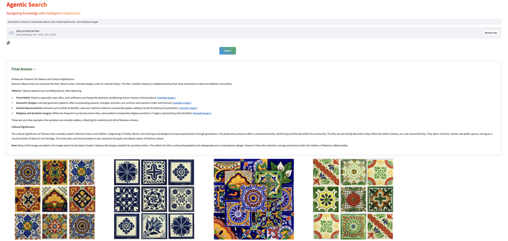
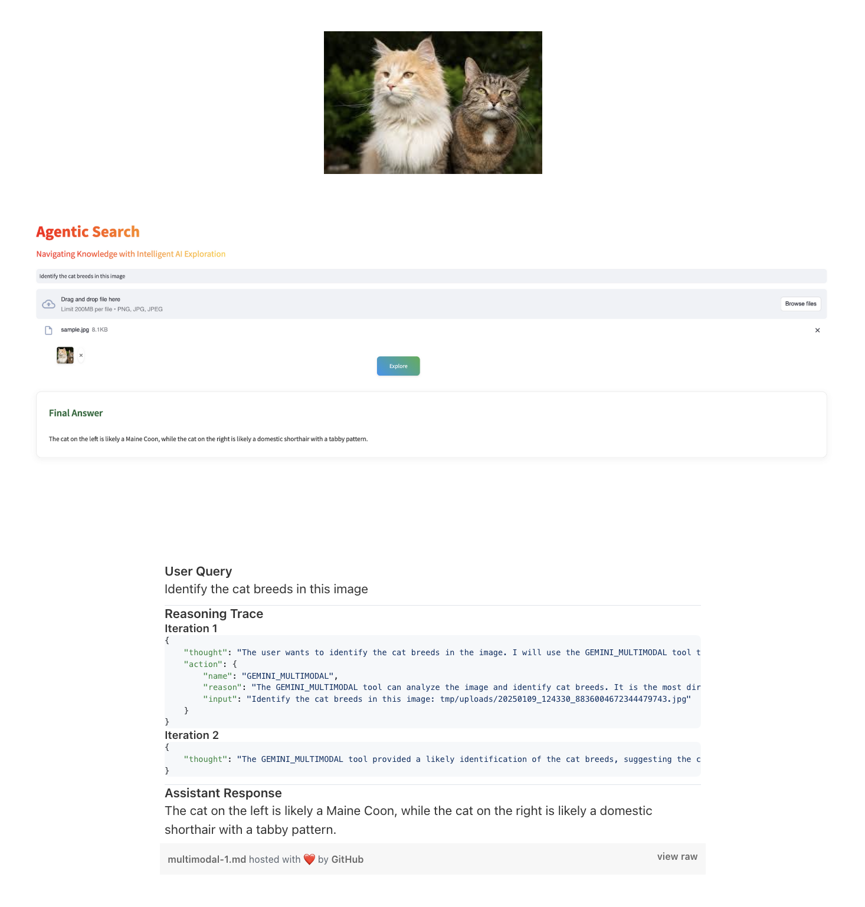

# Agentic Search

**Agentic Search** is an advanced AI-powered framework utilizing **Gemini 2.0** and a ReAct agent to perform complex searches and deliver detailed, cohesive answers. By synthesizing data from multiple APIs and leveraging a dynamic tool registry, it provides precise and scalable solutions for intricate queries.


# Key Features

- **Gemini 2.0 Integration**: Leverages Gemini 2.0's advanced natural language understanding and multimodal reasoning capabilities.  
- **ReAct Agent Framework**: Implements the ReAct framework for iterative reasoning and decision-making in complex tasks.  
- **Dynamic Tool Registry**: Seamlessly integrates tools, including Wikipedia search and Google Trends, to expand functionality.  
- **Multimodal Support**: Handles both text and image-based inputs to enrich query responses.  
- **Streamlined Interface**: Built with a clean and interactive UI using Streamlit for intuitive user interactions.

```mermaid
flowchart LR
    %% Define node styles
    classDef userNode fill:#fff,stroke:#a8a8a8,stroke-width:2px
    classDef taskNode fill:#ffecec,stroke:#ffd6d6,stroke-width:2px
    classDef agentNode fill:#f0f5ff,stroke:#e1e8ff,stroke-width:2px
    classDef toolNode fill:#ffffff,stroke:#e6e6e6,stroke-width:2px
    classDef envNode fill:#f2fff2,stroke:#e1ffe1,stroke-width:2px
    classDef defaultNode fill:#ffffff,stroke:#e6e6e6,stroke-width:2px

    User((User)):::userNode

    subgraph Input["Agentic Search UI"]
        direction TB
        Task[Task]
        Outcome[Outcome]
    end

    subgraph Agent[" ReAct Agent "]
        direction LR
        subgraph Core[" "]
            LLM["Gemini (LLM)"]
        end
        
        subgraph Tools[" "]
            API["Tools (APIs)"]
        end
        
        subgraph Memory[" "]
            Mem[Memory]
        end
    end

    subgraph Actions[" Actions "]
        direction TB
        Act["fa:fa-gear Actions"]
    end

    subgraph Environments[" Environments "]
        direction TB
        
        subgraph GoogleServices[" Google Services "]
            direction LR
            Search["Search"]
            News["News"]
            Maps["Maps"]
            Images["Images"]
            Shopping["Shopping"]
            Finance["Finance"]
            Trends["Trends"]
            Events["Events"]
            Play["Play Store"]
        end

        subgraph Knowledge[" Knowledge "]
            direction LR
            Wiki["Wikipedia"]
            Trivia["Facts & Trivia"]
            Lyrics["Lyrics"]
        end

        subgraph Demographics[" Demographics "]
            direction LR
            Age["Age Prediction"]
            Gender["Gender"]
            Nationality["Nationality"]
        end

        subgraph Location[" Location Services "]
            direction LR
            Zip["ZIP Info"]
            IP["IP Info"]
            ISS["ISS Location"]
        end

        subgraph Media[" Media & Images "]
            direction LR
            Dogs["Dog Images"]
            Fox["Fox Images"]
            MultiModal["Multimodal"]
        end

        subgraph Commerce[" Commerce "]
            direction LR
            Walmart["Walmart"]
        end
    end

    %% Connections with enhanced arrows
    User ====> Task
    Task ====> LLM
    LLM ====> |"Reasoning Loop"| API
    API ====> LLM
    LLM ====> Mem
    Mem ====> LLM
    API <====> Act
    Act <====> |"observations"| Environments
    LLM ====> Outcome
    Outcome ====> User

    %% Apply styles
    class Task,Outcome taskNode
    class LLM,API,Mem agentNode
    class Search,News,Maps,Images,Shopping,Finance,Trends,Events,Play,Wiki,Trivia,Lyrics,Age,Gender,Nationality,Zip,IP,ISS,Dogs,Fox,MultiModal,Walmart envNode
    class Act defaultNode

    %% Container styles
    style Input fill:transparent,stroke:#ffd6d6,stroke-width:2px
    style Agent fill:transparent,stroke:#e1e8ff,stroke-width:2px
    style Actions fill:transparent,stroke:#e6e6e6,stroke-width:2px
    style Environments fill:transparent,stroke:#e1ffe1,stroke-width:2px
    style Core fill:transparent,stroke:#e1e8ff,stroke-width:2px
    style Tools fill:transparent,stroke:#e6e6e6,stroke-width:2px
    style Memory fill:transparent,stroke:#e6e6e6,stroke-width:2px

    %% Link styles - Updated with consistent pastel colors
    linkStyle 0,1 stroke:#ff9999,stroke-width:3px
    linkStyle 2,3,4,5 stroke:#99b3ff,stroke-width:3px
    linkStyle 6,7 stroke:#b3d9b3,stroke-width:3px
    linkStyle 8,9 stroke:#ff9999,stroke-width:3px
```



# Prerequisites

1. Create a folder named `credentials`.  
2. Inside the folder, create a `.yml` file containing API keys for Google and SerpAPI as shown below:  
   ```yaml
   GOOGLE_API_KEY: xxxxxxxxx
   SERP_API_KEY: xxxxxx
   ```

# 

# Setup

Clone the repository and install the required dependencies:

```bash
git clone https://github.com/arunpshankar/AgenticSearch.git
cd Agentic-Search

# Create a virtual environment
python3 -m venv venv
source venv/bin/activate  # On Windows: venv\Scripts\activate

# Upgrade pip and install dependencies
pip install --upgrade pip
pip install -r requirements.txt
```

Set the necessary environment variables:

```bash
export PYTHONDONTWRITEBYTECODE=1
export PYTHONPATH=$PYTHONPATH:.
```

Ensure your `credentials` folder contains the required API keys.

# 

# Usage

1. **Run the Application**:  
   Launch the Agentic Search Streamlit app:  
   ```bash
   streamlit run src/workflow/app.py
   ```

2. **Provide Your Query**:  
   Enter your search query or upload an image via the interface.  

3. **View Results**:  
   Interact with the ReAct agent's reasoning trace and receive detailed, accurate answers.

# 

# Tools and APIs

Agentic Search integrates a variety of tools defined in `registry.py`, enabling diverse functionalities:

- **Wikipedia Tools**:
  - `get_wiki_search_results`: Fetch summaries and metadata from Wikipedia.

- **Facts and Trivia**:
  - `get_cat_fact`: Retrieve a random cat fact.
  - `get_multiple_cat_facts`: Fetch multiple cat facts.
  - `get_cat_breeds`: Retrieve a list of cat breeds.
  - `get_random_joke`: Fetch a random joke.
  - `get_ten_random_jokes`: Retrieve ten random jokes.
  - `get_random_joke_by_type`: Fetch a random joke of a specific type.
  - `get_trivia_questions`: Retrieve trivia questions.

- **Animal Images**:
  - `get_random_dog_image`: Fetch a random dog image.
  - `get_multiple_dog_images`: Retrieve multiple random dog images.
  - `get_random_dog_breed_image`: Fetch an image of a specific dog breed.
  - `get_random_fox_image`: Fetch a random fox image.

- **Demographic Predictions**:
  - `get_predicted_age_by_name`: Predict age based on a name.
  - `get_gender_by_name`: Predict gender based on a name.
  - `get_nationality_by_name`: Predict nationality based on a name.

- **Location and Public Data**:
  - `get_zip_info`: Retrieve location data for U.S. ZIP codes.
  - `get_public_ip`: Fetch the public IP address of the requester.
  - `get_iss_location`: Get the current location of the International Space Station.

- **Google and SerpAPI Tools**:
  - `get_google_search_results`: Perform a Google search.
  - `get_google_image_search_results`: Fetch Google Images search results.
  - `get_google_news_search`: Perform a Google News search.
  - `get_google_maps_search`: Search for places using Google Maps.
  - `get_google_maps_place`: Retrieve details of a specific place.
  - `get_google_jobs_search`: Perform a Google Jobs search.
  - `get_google_shopping_search`: Fetch Google Shopping results.
  - `get_google_local_basic_search`: Perform a local business search.
  - `get_google_play_query_search`: Search for apps in the Google Play Store.
  - `get_google_events_basic_search`: Retrieve event details from Google.
  - `get_google_videos_basic_search`: Perform a Google Videos search.
  - `get_google_finance_basic_search`: Fetch Google Finance data.
  - `get_google_finance_currency_exchange`: Retrieve exchange rate data for currency pairs.

- **Third-Party APIs**:
  - `get_walmart_basic_search`: Search for products on Walmart.
  - `get_lyrics`: Retrieve song lyrics.
  - `get_google_trends_interest_over_time`: Fetch Google Trends interest-over-time data.

- **Multimodal Reasoning**:
  - `get_multimodal_reasoning`: Perform reasoning based on both text and image inputs.

This comprehensive tool registry allows Agentic Search to address diverse and intricate queries effectively.

# Hands-On Examples
### 1. Finding Current Location and Identifying Locations of Interest


### 2. Identifying Patterns and Cultural Significance of Mexican Talavera Tiles


### 3. Accurate Breed Identification Through Multimodal Analysis


# 

# Contribution

We welcome contributions! Fork this repository and submit a pull request with detailed descriptions of your updates.

# 

# License

This project is licensed under the MIT License. See the `LICENSE` file for details.  